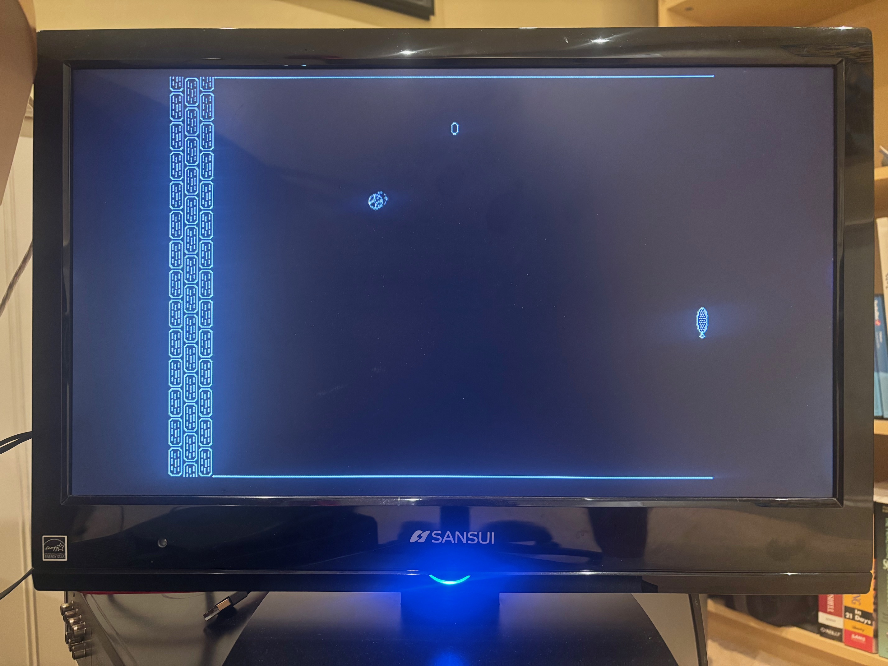

# PONG game for Raspberry Pi Pico 2

Video generator and "pong" game for RPi Pico 2 for NTSC composite video input. The project was created as an exercise in using Raspberry Pi Pico 0 peripherals.



## Resources

- NTSC video timing https://www.batsocks.co.uk/readme/video_timing.htm
- NTSC/PAL video format https://martin.hinner.info/vga/pal.html
- Bitmap drawing https://www.pixilart.com/

## Picture scan lines

```
PRE_EQUALIZING_PULSES       scan line    0 ... 2
VERTICAL_SYNC               scan line    3 ... 5
POST_EQUALIZING_PULSES      scan line    6 ... 8
PRE_RENDER_BLANK_SCAN_LINE  scan line    9 ... 29
FIRST_ACTIVE_SCAN_LINE      scan line   30 ... 245
POST_RENDER_BLANK_SCAN_LINE scan line  246 ... 262

```

Accounting for overscan, the resolution of the visible pixels is 576 pixel wide (reduced by overscan out of 640) by 432 pixels tall (reduced by overscan out of 480).

## Video generation

HSTX and DMA used to generate video pixel and sync signals. DMA moved 32bit words to HSTX that is configured to shift 16 bit pairs (pixel, sync) to HSTX GPIO pins. HSTX is clocked by 12MHz derived fom the USB PLL source divided by 4. The USB PLL divided source is routed to clock output GPOUT0 that is tied to GPIN0. GPIN0 is the auxiliary clock source for HSTX.

The `io.c` module handles low level IO configuration and access, the `video.c` module provides a set of video utility functions for drawing and text output, and the `ponggame.c` contains game code.

## Video timing

The 12MHz HSTX clock generates a bit shift time of 0.0834uSec. This bit shift time is the basis for the number of 32bit words and the corresponding bits that are either '1' or '0' in order to produce the resulting waveforms for Sync and pixels.
For example, a Sync pulse is 4.7uSec in duration. This requires 56 bit shifts given by (4.7 / 0.0834). This results is populating the Sync bit area with 56 consecutive '1' bits, which, when shifted by the HSTX, will produce a 4.7uSec long pulse.
Similarly, within the active video line that lasts 53.5uSec it is possible to generate ~640 pixels as given by (53.5 / 0.0834).

## Audio beeps

Audio tones are generated using Pico 2 PWM.

## GPIO pin assignments

```

Note: all digital GPIO outputs are connected through 74LS14

                            173
(HSTX1) GP13 pin-17 o-----/\/\/\/-----+             Pixel video
                                      |
                            645       |
(HSTX0) GP12 pin-16 o--+--/\/\/\/-----+-----------o SYNC + Pixel video signal to monitor/TV
                       |
                       +--------------------------o SYNC for scope external trigger
  
(PWM CH2A) pin-6    o--------+
                             |
                             \    4.7u  
                        10K  / <---||-------------o Audio out (~1V p-p)
                             \
                             /
                             |
                            GND

(ADC0) pin-31       o-----------------------------o 'paddle' center tap
    
```

